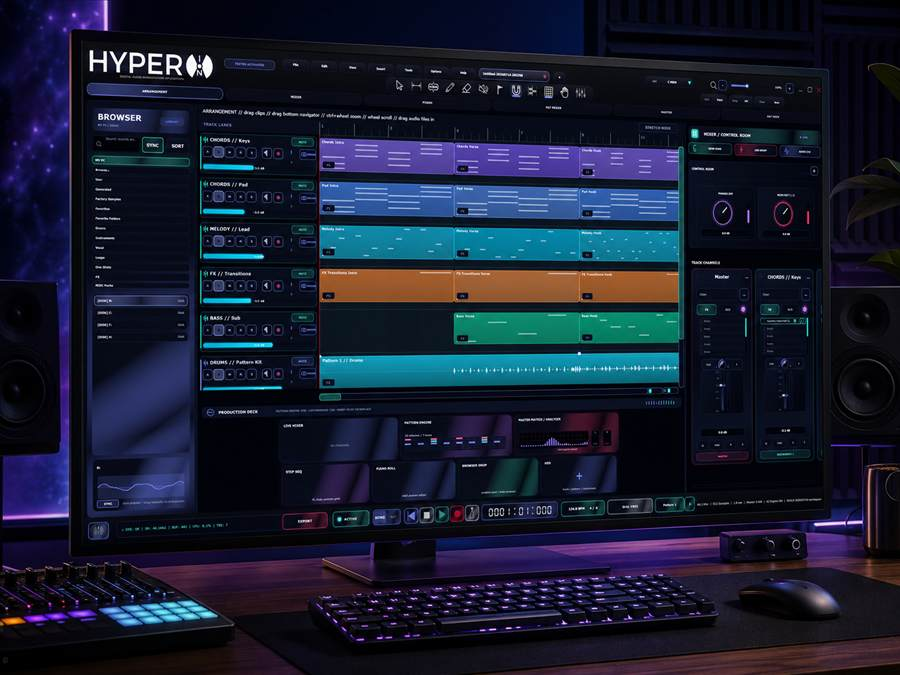
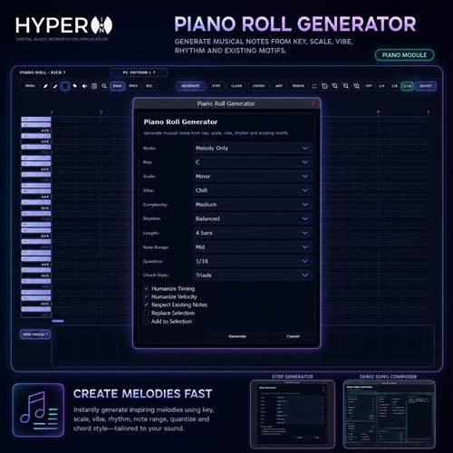
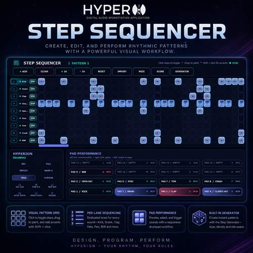
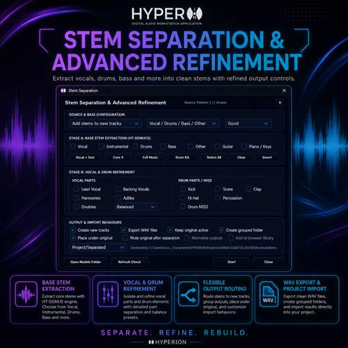
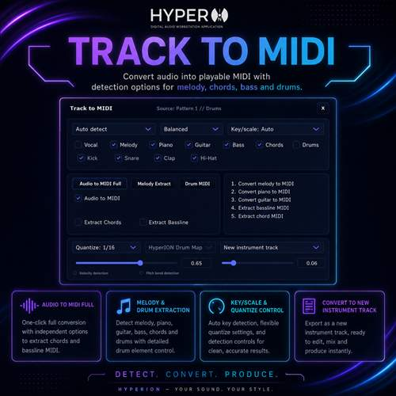
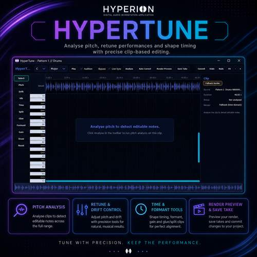
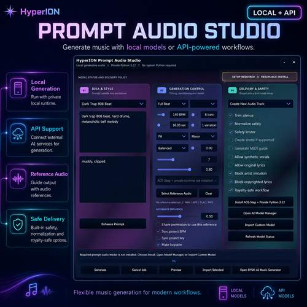

  

  # HyperION

  **A next-generation digital audio workstation for focused music production.**

  Record, arrange, compose, mix, master, and explore AI-assisted audio workflows in one modern production environment.

  [Get Demo](https://hyperiondaw.gumroad.com/l/hyperiondawdemo) · [Get Standard](https://hyperiondaw.gumroad.com/l/hyperiondaw) · [Get Ultimate](https://hyperiondaw.gumroad.com/l/hyperiondawpro) · [Follow updates](https://hyperiondaw.gumroad.com/subscribe) · [Download Setup](https://hyperiondaw.com/download)  · 

## From first idea to final master

HyperION brings the essential stages of music production into a single, fast workflow. Build arrangements with audio and MIDI, shape ideas in the piano roll and step sequencer, record performances, host VST3 instruments and effects, mix through a clear channel workflow, and export the finished track.

### Production essentials

- Multitrack audio recording and arrangement editing
- MIDI composition, piano roll, and pattern-based sequencing
- Mixer, routing, automation, metering, and mastering tools
- VST3 instrument and effect hosting
- Built-in effects and creative production tools
- Project save/load, audio export, and MIDI export

### AI-assisted workflows

Ultimate Edition expands HyperION with tools designed to shorten repetitive production work, including stem separation, track-to-MIDI, vocal cleanup, pitch correction, prompt-based audio tools, and assisted mastering.

<table>
  <tr>
    <td width="50%"> <strong>Piano Roll</strong> Compose and refine editable MIDI performances.</td>
    <td width="50%"> <strong>Step Sequencer</strong> Turn rhythmic ideas into patterns quickly.</td>
  </tr>
  <tr>
    <td width="50%"> <strong>Stem Separation</strong> Split a mix into production-ready stems.</td>
    <td width="50%"> <strong>Track to MIDI</strong> Convert musical audio into editable MIDI.</td>
  </tr>
  <tr>
    <td width="50%"> <strong>HyperTune</strong> Shape pitch and vocal performances visually.</td>
    <td width="50%"> <strong>Prompt Audio Studio</strong> Explore assisted sound generation inside the workflow.</td>
  </tr>
</table>

## Choose your edition

| Edition | Best for | Included |
| --- | --- | --- |
| [Demo](https://hyperiondaw.gumroad.com/l/hyperiondawdemo) | Trying the HyperION workflow | Core interface, recording, mixer, piano roll, and arrangement tools |
| [Standard](https://hyperiondaw.gumroad.com/l/hyperiondaw) | Everyday music production | Project saving, audio/MIDI export, production tools, and future Standard updates |
| [Ultimate](https://hyperiondaw.gumroad.com/l/hyperiondawpro) | The complete HyperION experience | Everything in Standard plus advanced AI production, stem, vocal, pitch, and mastering tools |

## Project status

HyperION is under active development. Commercial builds are distributed through the official Gumroad pages above. This repository is the public home for product information, release communication, bug reports, and feature discussions; application source code is not currently distributed here.

## Feedback and support

- Found a reproducible bug? [Open a bug report](https://github.com/hyperiondaw/HyperION/issues/new?template=bug_report.yml).
- Have an idea? [Start a feature request](https://github.com/hyperiondaw/HyperION/issues/new?template=feature_request.yml).
- Need help with a purchase or download? Contact HyperION through the [official Gumroad profile](https://hyperiondaw.gumroad.com/).
- Before posting, please read the [support guide](SUPPORT.md). Report sensitive security issues using the process in [SECURITY.md](SECURITY.md).

## Stay in the loop

[Follow HyperION updates](https://hyperiondaw.gumroad.com/subscribe) for product news, release announcements, and edition updates.

---

  HyperION is independent software built for musicians, producers, and creators.

